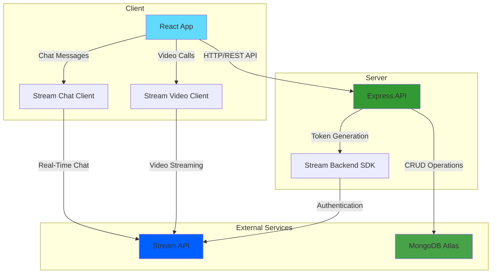

<div align="center">

# 🎥 Whisp

### Real-Time Video Calling & Chat Application

[](https://react.dev/)
[](https://nodejs.org/)
[](https://www.mongodb.com/)
[](https://getstream.io/)
[](https://render.com/)

**A modern, production-ready real-time messaging and video calling platform built with the MERN stack and Stream API. Fully configured for seamless deployment on Render.**

[Features](#features-) • [Tech Stack](#tech-stack-️) • [Quick Start](#quick-start-) • [Deployment](#deployment-on-render-) • [API Docs](#api-documentation-)

</div>

---

## Table of Contents 📖

- [About Whisp](#about-whisp-)
- [Features](#features-)
- [Tech Stack](#tech-stack-️)
- [System Architecture](#system-architecture-️)
- [Quick Start](#quick-start-)
  - [Prerequisites](#prerequisites)
  - [Installation](#installation)
  - [Environment Setup](#environment-setup)
- [Running Locally](#running-locally-)
- [Deployment on Render](#deployment-on-render-)
  - [Backend Deployment](#1-deploy-backend-nodejs--express--socketio)
  - [Frontend Deployment](#2-deploy-frontend-react-vite)
- [Project Structure](#project-structure-)
- [API Documentation](#api-documentation-)
- [Testing](#testing-)
- [Production Best Practices](#production-best-practices-️)
- [Troubleshooting](#troubleshooting-)
- [Roadmap](#roadmap-️)
- [Contributing](#contributing-)
- [License](#license-)
- [Contact](#contact-)

---

## About Whisp 💬

**Whisp** is a full-featured real-time communication platform that brings people together through instant messaging and high-quality video calls. Built with modern web technologies and powered by **Stream API**, Whisp provides a seamless communication experience with enterprise-grade security and scalability.

### Why Whisp?

- **🎯 Production-Ready**: Built with best practices for real-world deployment
- **🔐 Secure**: JWT-based authentication with refresh token mechanism
- **⚡ Real-Time**: Stream API for instant messaging and HD video calls
- **🎨 Customizable**: 32 beautiful UI themes to match your style
- **📱 Responsive**: Works flawlessly across all devices
- **🚀 Scalable**: Clean architecture designed for growth

---

## Features ✨

<table>
<tr>
<td>

### 💬 **Real-Time Messaging**
- Instant message delivery via Stream Chat
- Read receipts and typing indicators
- Message history and persistence
- Online/offline status tracking
- Group chat support
- **Message reactions with emojis** ✅
- Message threading

</td>
<td>

### 🎥 **Video Calling**
- HD video and audio quality
- Stream Video API integration
- Low-latency video calls
- Screen sharing capability
- Call controls (mute, video toggle, hang up)
- Noise cancellation

</td>
</tr>
<tr>
<td>

### 👥 **Friends System**
- Send and accept friend requests
- Friends list management
- User search and discovery
- Online status indicators
- Block/unblock functionality

</td>
<td>

### 🔐 **Authentication & Security**
- JWT access and refresh tokens
- Secure password hashing with bcrypt
- **Email verification on registration** ✅
- Protected routes with middleware
- CORS protection
- Rate limiting
- Stream token authentication

</td>
</tr>
<tr>
<td>

### 📧 **Email Service**
- **Brevo (Sendinblue) integration** ✅
- **Nodemailer for email delivery** ✅
- Welcome email on registration
- Email verification system
- Transactional email templates
- Professional email branding

</td>
<td>

### 🎨 **User Experience**
- Smooth onboarding flow
- 32 customizable UI themes
- Responsive design (mobile-first)
- Dark/light mode support
- Intuitive navigation
- Theme persistence

</td>
</tr>
</table>

---

## Tech Stack 🛠️

### **Frontend**

| Technology | Purpose | Version |
|------------|---------|---------|
|  | UI Library | 18+ |
|  | Build Tool & Dev Server | Latest |
|  | Server State Management | Latest |
|  | Client-Side Routing | Latest |
|  | Utility-First CSS | Latest |
|  | API Client | Latest |

### **Backend**

| Technology | Purpose | Version |
|------------|---------|---------|
|  | JavaScript Runtime | 18+ |
|  | Web Framework | 4.x |
|  | NoSQL Database | Latest |
|  | MongoDB Object Modeling | Latest |
|  | Real-Time Chat & Video | Latest |
|  | Token-Based Auth | Latest |
|  | Email Service | Latest |
|  | Email Delivery | Latest |

### **Testing & Tools**

| Tool | Purpose |
|------|---------|
| Jest | Unit Testing |
| Supertest | API Testing |
| Vitest | Frontend Testing |
| React Testing Library | Component Testing |
| ESLint | Code Linting |

---

## System Architecture 🏛️



### Data Flow

1. **Authentication**: User logs in → JWT tokens generated → Stream tokens created → Stored securely
2. **Messaging**: User sends message → Stream Chat SDK → Real-time delivery to recipient
3. **Video Call**: User initiates call → Stream Video SDK → Low-latency video connection established
4. **State Management**: TanStack Query manages server state with automatic caching and revalidation

---

## Quick Start 🚀

### Prerequisites

Ensure you have the following installed:

- **Node.js** v18.x or higher - [Download](https://nodejs.org/)
- **npm** or **yarn** - Comes with Node.js
- **MongoDB Atlas Account** - [Sign Up](https://www.mongodb.com/cloud/atlas/register) (Free tier available)
- **Git** - [Download](https://git-scm.com/)

### Installation

**1. Clone the repository**

```bash
git clone https://github.com/<your-username>/whisp.git
cd whisp
```

**2. Install Backend Dependencies**

```bash
cd server
npm install
```

**3. Install Frontend Dependencies**

```bash
cd ../client
npm install
```

### Environment Setup

#### Server `.env` (in `server/` directory)

```env
# Server Configuration
PORT=5000
NODE_ENV=development

# Database
MONGO_URI=mongodb+srv://<username>:<password>@cluster.mongodb.net/whisp?retryWrites=true&w=majority

# JWT Secrets (Use strong, random strings)
JWT_ACCESS_SECRET=your_super_secure_access_secret_min_32_characters
JWT_REFRESH_SECRET=your_super_secure_refresh_secret_min_32_characters

# Access Token Expiry
JWT_ACCESS_EXPIRY=15m
JWT_REFRESH_EXPIRY=7d

# Stream API Configuration
STREAM_API_KEY=your_stream_api_key
STREAM_API_SECRET=your_stream_api_secret

# Email Configuration (Brevo/Sendinblue)
BREVO_SMTP_HOST=smtp-relay.brevo.com
BREVO_SMTP_PORT=587
BREVO_SMTP_USER=your_brevo_smtp_login
BREVO_SMTP_PASSWORD=your_brevo_smtp_password
EMAIL_FROM=noreply@whisp.com
EMAIL_FROM_NAME=Whisp Team

# CORS - Client URL
CLIENT_URL=http://localhost:5173
```

#### Client `.env` (in `client/` directory)

```env
# API Configuration
VITE_API_URL=http://localhost:5000/api

# Stream API
VITE_STREAM_API_KEY=your_stream_api_key

# Environment
VITE_ENV=development
```

> ⚠️ **Security Note**: Never commit `.env` files to version control. Add `.env` to `.gitignore`.

---

## Running Locally 💻

### Start Backend Server

```bash
cd server
npm run dev
```

✅ Server running at: **http://localhost:5000**

### Start Frontend Development Server

```bash
cd client
npm run dev
```

✅ Frontend running at: **http://localhost:5173**

### Running Tests

**Backend Tests**

```bash
cd server
npm test
```

**Frontend Tests**

```bash
cd client
npm test
```

---

## Deployment on Render 🚀

Whisp is optimized for deployment on **Render**, with full WebSocket and WebRTC support.

### **Prerequisites for Deployment**

- Render account - [Sign Up Free](https://render.com/)
- GitHub repository connected to Render
- MongoDB Atlas database (production cluster)

---

### **1. Deploy Backend (Node.js + Express + Socket.IO)**

#### **Step 1: Create Web Service**

1. Go to **Render Dashboard** → Click **"New +"** → Select **"Web Service"**
2. Connect your GitHub repository
3. Configure the service:
   - **Name**: `whisp-backend` (or your preferred name)
   - **Region**: Choose closest to your users
   - **Branch**: `main` (or your production branch)
   - **Root Directory**: `server`
   - **Runtime**: `Node`

#### **Step 2: Build & Start Commands**

**Build Command:**
```bash
npm install
```

**Start Command:**
```bash
node src/index.js
```

> 💡 If your entry point is different, adjust accordingly (e.g., `node server.js`)

#### **Step 3: Environment Variables**

Add the following environment variables in Render:

| Variable | Value | Example |
|----------|-------|---------|
| `PORT` | `10000` | Render auto-assigns, but set explicitly |
| `NODE_ENV` | `production` | - |
| `MONGO_URI` | Your MongoDB Atlas connection string | `mongodb+srv://...` |
| `JWT_ACCESS_SECRET` | Strong random string (32+ chars) | Use password generator |
| `JWT_REFRESH_SECRET` | Strong random string (32+ chars) | Different from access secret |
| `STREAM_API_KEY` | Your Stream API Key | Get from Stream Dashboard |
| `STREAM_API_SECRET` | Your Stream API Secret | Get from Stream Dashboard |
| `BREVO_SMTP_HOST` | `smtp-relay.brevo.com` | Brevo SMTP server |
| `BREVO_SMTP_PORT` | `587` | SMTP port |
| `BREVO_SMTP_USER` | Your Brevo SMTP login | From Brevo dashboard |
| `BREVO_SMTP_PASSWORD` | Your Brevo SMTP password | From Brevo dashboard |
| `EMAIL_FROM` | `noreply@yourdomain.com` | Sender email |
| `EMAIL_FROM_NAME` | `Whisp Team` | Sender name |
| `CLIENT_URL` | Your Render frontend URL | `https://whisp-app.onrender.com` |

#### **Step 4: Health Check Endpoint**

Render pings your service to check health. Ensure you have:

```javascript
// In your Express app
app.get('/api/health', (req, res) => {
  res.status(200).json({ status: 'OK', timestamp: new Date().toISOString() });
});
```

#### **Step 5: Deploy**

Click **"Create Web Service"** - Render will:
1. Clone your repository
2. Install dependencies
3. Build and deploy
4. Provide a live URL: `https://whisp-backend.onrender.com`

---

### **2. Deploy Frontend (React Vite)**

#### **Step 1: Create Static Site**

1. **Render Dashboard** → **"New +"** → **"Static Site"**
2. Connect your repository
3. Configure:
   - **Name**: `whisp-frontend`
   - **Branch**: `main`
   - **Root Directory**: `client`

#### **Step 2: Build Configuration**

**Build Command:**
```bash
npm install && npm run build
```

**Publish Directory:**
```bash
dist
```

#### **Step 3: Environment Variables**

Add these environment variables:

| Variable | Value |
|----------|-------|
| `VITE_API_URL` | `https://whisp-backend.onrender.com/api` |
| `VITE_STREAM_API_KEY` | Your Stream API Key (same as backend) |
| `VITE_ENV` | `production` |

> ⚠️ **Important**: Replace `whisp-backend.onrender.com` with your actual backend URL from Step 1

#### **Step 4: Deploy**

Click **"Create Static Site"**

Render will build and deploy. Your app will be live at:
```
https://whisp-frontend.onrender.com
```

---

### **3. Connect Frontend & Backend**

#### **Update CORS Settings**

In your backend `server/src/server.js` (or main file):

```javascript
const cors = require('cors');

app.use(cors({
  origin: process.env.CLIENT_URL, // https://whisp-frontend.onrender.com
  credentials: true
}));
```

#### **Stream API Integration**

**Backend - Stream Token Generation:**

```javascript
// lib/stream.js
const { StreamChat } = require('stream-chat');

const serverClient = StreamChat.getInstance(
  process.env.STREAM_API_KEY,
  process.env.STREAM_API_SECRET
);

const generateStreamToken = (userId) => {
  return serverClient.createToken(userId);
};

module.exports = { serverClient, generateStreamToken };
```

**Frontend - Stream Client Initialization:**

```javascript
// lib/stream.js or appropriate file
import { StreamChat } from 'stream-chat';

const client = StreamChat.getInstance(import.meta.env.VITE_STREAM_API_KEY);

export { client };
```

#### **Update Backend CLIENT_URL**

Go back to your **backend service** environment variables and update:

```
CLIENT_URL=https://whisp-frontend.onrender.com
```

This ensures proper CORS configuration.

---

### **4. Verify Deployment**

✅ **Checklist:**

- [ ] Backend health endpoint responds: `https://your-backend.onrender.com/api/health`
- [ ] Frontend loads without errors
- [ ] Login/Registration works
- [ ] Stream Chat connects successfully
- [ ] Real-time chat messages appear instantly
- [ ] Video calls connect with low latency
- [ ] Theme switching persists across sessions
- [ ] Friend requests work correctly

---

## Project Structure 📁

```
whisp/
│
├── 📂 backend/                     # Backend application
│   ├── 📂 src/
│   │   ├── 📂 controllers/        # Route controllers
│   │   │   ├── auth.controller.js # Authentication logic
│   │   │   ├── user.controller.js # User management
│   │   │   └── chat.controller.js # Chat functionality
│   │   ├── 📂 lib/                # Libraries & utilities
│   │   │   ├── db.js              # MongoDB connection
│   │   │   └── stream.js          # Stream API configuration
│   │   ├── 📂 middleware/         # Custom middleware
│   │   │   └── auth.middleware.js # JWT verification
│   │   ├── 📂 models/             # Mongoose schemas
│   │   │   ├── User.js
│   │   │   └── FriendRequest.js
│   │   ├── 📂 routes/             # API routes
│   │   │   ├── auth.route.js
│   │   │   ├── user.route.js
│   │   │   └── chat.route.js
│   │   └── server.js              # Entry point
│   ├── package.json
│   ├── package-lock.json
│   └── .env
│
├── 📂 frontend/                    # Frontend application
│   ├── 📂 public/                 # Static assets
│   ├── 📂 src/
│   │   ├── 📂 components/         # React components
│   │   │   ├── CallButton.jsx
│   │   │   ├── ChatLoader.jsx
│   │   │   ├── FriendCard.jsx
│   │   │   ├── Layout.jsx
│   │   │   ├── Navbar.jsx
│   │   │   ├── NoFriendsFound.jsx
│   │   │   ├── NoNotificationsFound.jsx
│   │   │   ├── PageLoader.jsx
│   │   │   ├── Sidebar.jsx
│   │   │   └── ThemeSelector.jsx
│   │   ├── 📂 constants/          # App constants
│   │   │   └── index.js
│   │   ├── 📂 hooks/              # Custom React hooks
│   │   │   ├── useAuthUser.js
│   │   │   ├── useLogin.js
│   │   │   ├── useLogout.js
│   │   │   └── useSignUp.js
│   │   ├── 📂 lib/                # Utilities
│   │   │   ├── api.js             # Axios instance
│   │   │   ├── axios.js
│   │   │   └── utils.js
│   │   ├── 📂 pages/              # Page components
│   │   │   ├── CallPage.jsx
│   │   │   ├── ChatPage.jsx
│   │   │   ├── HomePage.jsx
│   │   │   ├── LoginPage.jsx
│   │   │   ├── NotificationsPage.jsx
│   │   │   ├── OnboardingPage.jsx
│   │   │   └── SignUpPage.jsx
│   │   ├── 📂 store/              # State management
│   │   │   └── useThemeStore.js   # Theme store (Zustand)
│   │   ├── App.jsx                # Root component
│   │   ├── main.jsx               # Entry point
│   │   └── index.css              # Global styles
│   ├── index.html
│   ├── package.json
│   ├── package-lock.json
│   ├── vite.config.js
│   ├── eslint.config.js
│   └── README.md
│
├── 📄 .gitignore
├── 📄 README.md
└── 📄 package.json
```

### 📋 Key Directories Explained

#### **Backend**
- **`controllers/`** - Business logic for authentication, users, and chat
- **`lib/`** - Database connection and Stream API configuration
- **`middleware/`** - JWT authentication middleware
- **`models/`** - MongoDB/Mongoose schemas
- **`routes/`** - API endpoint definitions

#### **Frontend**
- **`components/`** - Reusable UI components (Navbar, Cards, Loaders, Theme Selector)
- **`hooks/`** - Custom React hooks for auth and API calls
- **`pages/`** - Full page components (Chat, Call, Notifications, Onboarding)
- **`lib/`** - API utilities and Axios configuration
- **`store/`** - Zustand store for theme management
- **`constants/`** - App-wide constants

## API Documentation 📡

### Base URL

**Development:**
```
http://localhost:5000/api
```

**Production:**
```
https://your-backend.onrender.com/api
```

---

### Authentication Endpoints 🔐

#### Register User

```http
POST /api/auth/register
Content-Type: application/json

{
  "username": "johndoe",
  "email": "john@example.com",
  "password": "SecurePassword123!",
  "displayName": "John Doe"
}
```

**Response:**
```json
{
  "success": true,
  "message": "User registered successfully",
  "data": {
    "user": {
      "id": "64f7a3b2c...",
      "username": "johndoe",
      "email": "john@example.com",
      "displayName": "John Doe"
    },
    "tokens": {
      "accessToken": "eyJhbGci...",
      "refreshToken": "eyJhbGci..."
    }
  }
}
```

#### Login

```http
POST /api/auth/login
Content-Type: application/json

{
  "email": "john@example.com",
  "password": "SecurePassword123!"
}
```

#### Refresh Token

```http
POST /api/auth/refresh
Content-Type: application/json

{
  "refreshToken": "eyJhbGci..."
}
```

#### Logout

```http
POST /api/auth/logout
Authorization: Bearer <access_token>
```

---

### User Endpoints 👤

#### Get Current User

```http
GET /api/users/me
Authorization: Bearer <access_token>
```

#### Update Profile

```http
PUT /api/users/profile
Authorization: Bearer <access_token>
Content-Type: application/json

{
  "displayName": "John Smith",
  "avatar": "https://example.com/avatar.jpg",
  "bio": "Software Developer"
}
```

#### Search Users

```http
GET /api/users/search?q=john
Authorization: Bearer <access_token>
```

---

### Friends Endpoints 👥

#### Get Friends List

```http
GET /api/friends
Authorization: Bearer <access_token>
```

#### Send Friend Request

```http
POST /api/friends/request
Authorization: Bearer <access_token>
Content-Type: application/json

{
  "recipientId": "64f7a3b2c..."
}
```

#### Accept Friend Request

```http
PUT /api/friends/request/:requestId/accept
Authorization: Bearer <access_token>
```

#### Reject Friend Request

```http
PUT /api/friends/request/:requestId/reject
Authorization: Bearer <access_token>
```

---

### Message Endpoints 💬

#### Get Conversation Messages

```http
GET /api/messages/conversation/:userId?limit=50&offset=0
Authorization: Bearer <access_token>
```

#### Send Message

```http
POST /api/messages
Authorization: Bearer <access_token>
Content-Type: application/json

{
  "recipientId": "64f7a3b2c...",
  "content": "Hello there!",
  "type": "text"
}
```

---

### Email Service Configuration 📧

**Whisp uses Brevo (formerly Sendinblue) for reliable email delivery via Nodemailer.**

#### **1. Get Brevo Credentials**

1. Sign up at [Brevo.com](https://www.brevo.com/) (Free tier: 300 emails/day)
2. Go to **Settings** → **SMTP & API**
3. Create new SMTP key
4. Note down:
   - SMTP Server: `smtp-relay.brevo.com`
   - Port: `587`
   - Login (username)
   - SMTP Key (password)

#### **2. Backend - Nodemailer Configuration**

```javascript
// lib/emailService.js or similar
const nodemailer = require('nodemailer');

const transporter = nodemailer.createTransport({
  host: process.env.BREVO_SMTP_HOST,
  port: process.env.BREVO_SMTP_PORT,
  secure: false, // Use TLS
  auth: {
    user: process.env.BREVO_SMTP_USER,
    pass: process.env.BREVO_SMTP_PASSWORD
  }
});

// Send welcome email on registration
const sendWelcomeEmail = async (userEmail, userName) => {
  const mailOptions = {
    from: `"${process.env.EMAIL_FROM_NAME}" <${process.env.EMAIL_FROM}>`,
    to: userEmail,
    subject: 'Welcome to Whisp! 🎉',
    html: `
      <div style="font-family: Arial, sans-serif; max-width: 600px; margin: 0 auto;">
        <h1 style="color: #005FFF;">Welcome to Whisp, ${userName}! 👋</h1>
        <p>Thank you for joining Whisp - your new favorite way to stay connected.</p>
        <p>You can now:</p>
        <ul>
          <li>Send instant messages to friends</li>
          <li>Make HD video calls</li>
          <li>Customize your theme from 32+ options</li>
          <li>And much more!</li>
        </ul>
        <a href="${process.env.CLIENT_URL}/login" 
           style="display: inline-block; background: #005FFF; color: white; 
                  padding: 12px 24px; text-decoration: none; border-radius: 5px; 
                  margin: 20px 0;">
          Start Chatting
        </a>
        <p style="color: #666; font-size: 12px; margin-top: 30px;">
          © ${new Date().getFullYear()} Whisp. All rights reserved.
        </p>
      </div>
    `
  };

  await transporter.sendMail(mailOptions);
};

// Send verification email
const sendVerificationEmail = async (userEmail, verificationToken) => {
  const verificationUrl = `${process.env.CLIENT_URL}/verify-email?token=${verificationToken}`;
  
  const mailOptions = {
    from: `"${process.env.EMAIL_FROM_NAME}" <${process.env.EMAIL_FROM}>`,
    to: userEmail,
    subject: 'Verify Your Whisp Account ✉️',
    html: `
      <div style="font-family: Arial, sans-serif; max-width: 600px; margin: 0 auto;">
        <h1 style="color: #005FFF;">Email Verification</h1>
        <p>Please verify your email address to complete your registration.</p>
        <a href="${verificationUrl}" 
           style="display: inline-block; background: #005FFF; color: white; 
                  padding: 12px 24px; text-decoration: none; border-radius: 5px; 
                  margin: 20px 0;">
          Verify Email
        </a>
        <p style="color: #666;">If you didn't create this account, please ignore this email.</p>
        <p style="color: #999; font-size: 12px;">This link will expire in 24 hours.</p>
      </div>
    `
  };

  await transporter.sendMail(mailOptions);
};

module.exports = { sendWelcomeEmail, sendVerificationEmail };
```

#### **3. Usage in Auth Controller**

```javascript
// controllers/auth.controller.js
const { sendWelcomeEmail, sendVerificationEmail } = require('../lib/emailService');

const register = async (req, res) => {
  try {
    // Create user
    const user = await User.create({
      email: req.body.email,
      password: hashedPassword,
      name: req.body.name
      // ...other fields
    });

    // Generate verification token
    const verificationToken = generateToken();
    user.verificationToken = verificationToken;
    await user.save();

    // Send welcome & verification emails
    await Promise.all([
      sendWelcomeEmail(user.email, user.name),
      sendVerificationEmail(user.email, verificationToken)
    ]);

    res.status(201).json({ 
      success: true, 
      message: 'Registration successful! Please check your email to verify your account.' 
    });
  } catch (error) {
    console.error('Registration error:', error);
    res.status(500).json({ success: false, message: 'Registration failed' });
  }
};
```

#### **4. Email Templates Best Practices**

- Use responsive HTML templates
- Include clear call-to-action buttons
- Add unsubscribe links (for transactional emails, optional)
- Test emails before deployment
- Monitor delivery rates in Brevo dashboard

#### **5. Brevo Dashboard Features**

- **Email Analytics**: Track open rates, click rates
- **Template Editor**: Create reusable email templates
- **Contact Management**: Manage subscriber lists
- **A/B Testing**: Test different email variations
- **SMS & WhatsApp**: Extend to other channels (paid plans)

---

### Stream API Integration 🌊

#### Stream Chat Setup

**Backend - Initialize Stream Client:**

```javascript
// lib/stream.js
const { StreamChat } = require('stream-chat');

const serverClient = StreamChat.getInstance(
  process.env.STREAM_API_KEY,
  process.env.STREAM_API_SECRET
);

module.exports = { serverClient };
```

**Backend - Generate User Token:**

```javascript
// In your auth controller
const { serverClient } = require('../lib/stream');

const generateStreamToken = (userId) => {
  return serverClient.createToken(userId);
};

// Return token on login/registration
res.json({
  user,
  token: jwtToken,
  streamToken: generateStreamToken(user._id.toString())
});
```

**Frontend - Connect to Stream:**

```javascript
// In your auth hook or component
import { StreamChat } from 'stream-chat';

const connectToStream = async (user, streamToken) => {
  const client = StreamChat.getInstance(import.meta.env.VITE_STREAM_API_KEY);
  
  await client.connectUser(
    {
      id: user.id,
      name: user.name,
      image: user.avatar
    },
    streamToken
  );
  
  return client;
};
```

#### Stream Video Setup

**Initialize Video Client:**

```javascript
import { StreamVideoClient } from '@stream-io/video-react-sdk';

const videoClient = new StreamVideoClient({
  apiKey: import.meta.env.VITE_STREAM_API_KEY,
  user: {
    id: userId,
    name: userName,
    image: userAvatar
  },
  token: streamToken
});
```

**Create/Join Video Call:**

```javascript
const call = videoClient.call('default', callId);
await call.join({ create: true });

// Publish local video/audio
await call.camera.enable();
await call.microphone.enable();
```

---

## Testing 🧪

### Backend Testing (Jest + Supertest)

**Run all tests:**
```bash
cd server
npm test
```

**Run with coverage:**
```bash
npm run test:coverage
```

**Test specific file:**
```bash
npm test -- auth.test.js
```

**Example Test:**
```javascript
// tests/auth.test.js
const request = require('supertest');
const app = require('../src/index');

describe('POST /api/auth/register', () => {
  it('should register a new user', async () => {
    const res = await request(app)
      .post('/api/auth/register')
      .send({
        username: 'testuser',
        email: 'test@example.com',
        password: 'Test123!'
      });
    
    expect(res.statusCode).toBe(201);
    expect(res.body.success).toBe(true);
    expect(res.body.data.user.email).toBe('test@example.com');
  });
});
```

---

### Frontend Testing (Vitest + React Testing Library)

**Run all tests:**
```bash
cd client
npm test
```

**Run in watch mode:**
```bash
npm run test:watch
```

**Example Component Test:**
```javascript
// tests/LoginForm.test.jsx
import { render, screen, fireEvent } from '@testing-library/react';
import { describe, it, expect } from 'vitest';
import LoginForm from '../src/components/auth/LoginForm';

describe('LoginForm', () => {
  it('renders login form', () => {
    render(<LoginForm />);
    expect(screen.getByLabelText(/email/i)).toBeInTheDocument();
    expect(screen.getByLabelText(/password/i)).toBeInTheDocument();
  });

  it('submits form with credentials', async () => {
    render(<LoginForm />);
    
    fireEvent.change(screen.getByLabelText(/email/i), {
      target: { value: 'test@example.com' }
    });
    fireEvent.change(screen.getByLabelText(/password/i), {
      target: { value: 'password123' }
    });
    
    fireEvent.click(screen.getByRole('button', { name: /login/i }));
    
    // Add assertions for form submission
  });
});
```

---

## Production Best Practices 🛡️

### Security Headers (Helmet.js)

```javascript
const helmet = require('helmet');
app.use(helmet());
```

### Rate Limiting

```javascript
const rateLimit = require('express-rate-limit');

const limiter = rateLimit({
  windowMs: 15 * 60 * 1000, // 15 minutes
  max: 100 // limit each IP to 100 requests per windowMs
});

app.use('/api/', limiter);
```

### Environment Variables Validation

```javascript
const requiredEnvVars = [
  'MONGO_URI',
  'JWT_ACCESS_SECRET',
  'JWT_REFRESH_SECRET',
  'CLIENT_URL'
];

requiredEnvVars.forEach(varName => {
  if (!process.env[varName]) {
    throw new Error(`Missing required environment variable: ${varName}`);
  }
});
```

### MongoDB Connection with Retry Logic

```javascript
const connectDB = async (retries = 5) => {
  try {
    await mongoose.connect(process.env.MONGO_URI, {
      useNewUrlParser: true,
      useUnifiedTopology: true
    });
    console.log('✅ MongoDB connected');
  } catch (error) {
    if (retries > 0) {
      console.log(`Retrying connection... (${retries} attempts left)`);
      setTimeout(() => connectDB(retries - 1), 5000);
    } else {
      console.error('❌ MongoDB connection failed:', error);
      process.exit(1);
    }
  }
};
```

### Health Check Endpoint

```javascript
app.get('/api/health', (req, res) => {
  const healthcheck = {
    uptime: process.uptime(),
    status: 'OK',
    timestamp: new Date().toISOString(),
    environment: process.env.NODE_ENV,
    mongodb: mongoose.connection.readyState === 1 ? 'Connected' : 'Disconnected'
  };
  res.status(200).json(healthcheck);
});
```

### Stream API Configuration

**Get Your Stream Credentials:**

1. Sign up at [GetStream.io](https://getstream.io/)
2. Create a new app
3. Get your API Key and Secret from the dashboard
4. Add them to your environment variables

**Stream Chat Features:**

```javascript
// Enable typing indicators
channel.keystroke();

// Send message with attachments
await channel.sendMessage({
  text: 'Hello!',
  attachments: [
    {
      type: 'image',
      asset_url: 'https://example.com/image.jpg'
    }
  ]
});

// Add message reaction (Already Implemented ✅)
await channel.sendReaction(messageId, {
  type: 'love' // or 'like', 'haha', 'wow', 'sad', 'angry'
});

// Remove reaction
await channel.deleteReaction(messageId, 'love');

// Listen for reactions
channel.on('reaction.new', (event) => {
  console.log('New reaction:', event.reaction);
});

channel.on('reaction.deleted', (event) => {
  console.log('Reaction removed:', event.reaction);
});

// Mark messages as read
await channel.markRead();
```

**Stream Video Features:**

```javascript
// Screen sharing
await call.screenShare.enable();

// Toggle video/audio
await call.camera.toggle();
await call.microphone.toggle();

// Leave call
await call.leave();
```

### Logging (Winston)

```javascript
const winston = require('winston');

const logger = winston.createLogger({
  level: 'info',
  format: winston.format.json(),
  transports: [
    new winston.transports.File({ filename: 'error.log', level: 'error' }),
    new winston.transports.File({ filename: 'combined.log' })
  ]
});

if (process.env.NODE_ENV !== 'production') {
  logger.add(new winston.transports.Console({
    format: winston.format.simple()
  }));
}
```

---

## Troubleshooting 🔧

### Common Issues & Solutions

#### **Stream Connection Failed**

**Problem:** Unable to connect to Stream Chat/Video

**Solutions:**
1. **Verify API credentials** in environment variables
2. **Check token generation** - ensure user ID matches
3. **Inspect browser console** for Stream SDK errors

```javascript
// Enable Stream debugging
import { StreamChat } from 'stream-chat';

const client = StreamChat.getInstance(apiKey);
client.setLogLevel('info'); // or 'debug' for more details
```

---

#### **Chat Messages Not Appearing**

**Problem:** Messages sent but not received

**Solutions:**
1. **Check channel connection** - ensure user is connected to the correct channel
2. **Verify user permissions** - check Stream dashboard for user roles
3. **Check event listeners** - ensure message event handlers are set up

```javascript
// Proper channel setup
const channel = client.channel('messaging', channelId, {
  members: [currentUserId, recipientId]
});

await channel.watch();

channel.on('message.new', (event) => {
  console.log('New message:', event.message);
});
```

---

#### **Video Call Not Connecting**

**Problem:** Video call fails to establish

**Solutions:**
1. **Check browser permissions** for camera/microphone
2. **Verify Stream Video SDK** is properly initialized
3. **Check call state** using Stream dashboard

```javascript
// Debug video connection
call.on('call.updated', (event) => {
  console.log('Call state:', event.call.state);
});
```

---

#### **CORS Errors**

**Problem:** `Access-Control-Allow-Origin` errors

**Solution:**
```javascript
// Backend - Ensure CLIENT_URL is correctly set
const cors = require('cors');

app.use(cors({
  origin: process.env.CLIENT_URL,
  credentials: true
}));
```

---

#### **MongoDB Connection Timeout**

**Problem:** Can't connect to MongoDB Atlas

**Solutions:**
- Whitelist Render IP addresses in MongoDB Atlas Network Access
- Or allow access from anywhere: `0.0.0.0/0` (less secure)
- Verify MONGO_URI format
- Check MongoDB Atlas cluster is running

---

#### **Stream Token Issues**

**Problem:** Invalid or expired Stream token

**Solutions:**
1. **Regenerate token** on backend
2. **Check token expiration** - Stream tokens don't expire by default but can be set
3. **Verify user ID consistency** between JWT and Stream

```javascript
// Backend - Consistent user ID
const streamToken = serverClient.createToken(user._id.toString());
```

---

#### **Email Delivery Issues**

**Problem:** Welcome/verification emails not being sent or received

**Solutions:**
1. **Verify Brevo credentials** in environment variables
2. **Check spam/junk folder** - welcome emails might be filtered
3. **Verify sender email** is authenticated in Brevo dashboard
4. **Check Brevo dashboard** for delivery logs and error messages
5. **Test email service connection** separately:

```javascript
// Test email service
const nodemailer = require('nodemailer');

const testEmailService = async () => {
  try {
    const transporter = nodemailer.createTransport({
      host: process.env.BREVO_SMTP_HOST,
      port: process.env.BREVO_SMTP_PORT,
      auth: {
        user: process.env.BREVO_SMTP_USER,
        pass: process.env.BREVO_SMTP_PASSWORD
      }
    });

    await transporter.verify();
    console.log('✅ Email service is ready');
  } catch (error) {
    console.error('❌ Email service error:', error);
  }
};
```

6. **Check daily limits** - Brevo free tier: 300 emails/day
7. **Monitor Brevo logs** for bounces, blocks, or spam reports
8. **Verify PORT 587** is not blocked by firewall
9. **Use environment-specific email** (test email for dev, real for prod)

---

#### **Environment Variables Not Loading**

**Problem:** `process.env.VARIABLE` is undefined

**Solution:**
- In Render, re-check all environment variables are set
- Ensure no typos in variable names
- For Vite frontend, variables must start with `VITE_`
- Redeploy after adding new variables

---

## Roadmap 🗺️

### ✅ Completed

- [x] Real-time messaging with Stream Chat API
- [x] HD video calling with Stream Video API
- [x] JWT authentication with refresh tokens
- [x] **Message reactions with emoji support** ✅
- [x] **Email verification on registration (Brevo + Nodemailer)** ✅
- [x] Welcome emails for new users
- [x] Friends system
- [x] 32 UI themes with persistence
- [x] Responsive design
- [x] Render deployment configuration
- [x] Onboarding flow

### 🚧 In Progress

- [ ] User profile customization
- [ ] Push notifications
- [ ] Message search functionality

### 📋 Planned Features

#### **Phase 1: Enhanced Communication**
- [ ] Voice messages
- [ ] File sharing (images, documents)
- [ ] Message editing and deletion
- [ ] Message search functionality
- [ ] Advanced emoji picker
- [ ] Message pinning
- [ ] Thread replies

#### **Phase 2: Advanced Features**
- [ ] Group chats
- [ ] Channel-based communities
- [ ] Voice-only calls
- [ ] Call recording
- [ ] Noise cancellation
- [ ] Virtual backgrounds

#### **Phase 3: User Experience**
- [ ] Push notifications (Web Push API)
- [ ] Email notifications
- [ ] Custom notification sounds
- [ ] Status messages ("Available", "Busy", "Away")
- [ ] Profile customization
- [ ] Accessibility improvements (ARIA labels, keyboard navigation)

#### **Phase 4: Admin & Moderation**
- [ ] Admin dashboard
- [ ] User reporting system
- [ ] Content moderation
- [ ] Analytics and insights
- [ ] User activity logs

#### **Phase 5: DevOps & Scaling**
- [ ] Docker containerization
- [ ] Kubernetes deployment
- [ ] CI/CD pipeline (GitHub Actions)
- [ ] Load balancing
- [ ] CDN integration for static assets
- [ ] Redis for session management
- [ ] Message queue (Bull/RabbitMQ)

#### **Phase 6: Mobile**
- [ ] React Native mobile app
- [ ] iOS and Android support
- [ ] Mobile push notifications

---

## Contributing 🤝

Contributions make the open-source community an amazing place to learn and create. Any contributions you make are **greatly appreciated**!

### How to Contribute

1. **Fork the Project**
2. **Create your Feature Branch**
   ```bash
   git checkout -b feature/AmazingFeature
   ```
3. **Commit your Changes**
   ```bash
   git commit -m 'Add some AmazingFeature'
   ```
4. **Push to the Branch**
   ```bash
   git push origin feature/AmazingFeature
   ```
5. **Open a Pull Request**

### Code Style Guidelines

- Follow existing code formatting
- Write meaningful commit messages (use [Conventional Commits](https://www.conventionalcommits.org/))
- Add comments for complex logic
- Write tests for new features
- Update documentation as needed

### Reporting Bugs

Found a bug? Please open an issue with:
- Clear description of the problem
- Steps to reproduce
- Expected vs actual behavior
- Screenshots (if applicable)
- Environment details (OS, browser, Node version)

---

## License 📜

Distributed under the **MIT License**. See `LICENSE` file for more information.

---

## Contact 👨‍💻

**Devansh Kumar Tiwari**  
Full-Stack Developer

- 💼 **Portfolio**: [yourportfolio.com](https://devansh-tiwari-full-stack-developer.vercel.app)
- 🐙 **GitHub**: [@yourusername](https://github.com/yo-soy-dev)
- 💼 **LinkedIn**: [Your LinkedIn](https://linkedin.com/in/yo-soy-dev)
- 📧 **Email**: devanshtiwari817@gmail.com
- 🐦 **X**: [@yourhandle](https://x.com/soy_yo_dev40)

**Project Link**: [https://github.com/yourusername/whisp](https://github.com/yo-soy-dev/Whisp)

**Live Demo**: [https://whisp-app.onrender.com](https://whisp-app.onrender.com)

---

## Acknowledgments 🙏

Special thanks to these amazing resources:

- [Stream API Documentation](https://getstream.io/chat/docs/)
- [Stream Video Documentation](https://getstream.io/video/docs/)
- [Brevo (Sendinblue) Documentation](https://developers.brevo.com/)
- [Nodemailer Documentation](https://nodemailer.com/)
- [React Documentation](https://react.dev/)
- [TanStack Query](https://tanstack.com/query/latest)
- [MongoDB University](https://university.mongodb.com/)
- [Render Documentation](https://render.com/docs)
- [MDN Web Docs](https://developer.mozilla.org/)
- [Tailwind CSS](https://tailwindcss.com/)

---

## Show Your Support ⭐

If you found Whisp helpful or learned something from it:

- ⭐ **Star this repository**
- 🍴 **Fork it** for your own projects  
- 👀 **Watch** for updates
- 📢 **Share** with others
- 💬 **Provide feedback** via issues

---

<div align="center">

### 💡 Built with passion for real-time communication

**Made with ❤️ using the MERN Stack & Stream API**

[](https://github.com/yourusername/whisp)
[](https://github.com/yourusername)

---

**Need help?** Open an issue or reach out on [Twitter](https://twitter.com/yourhandle)

</div>
